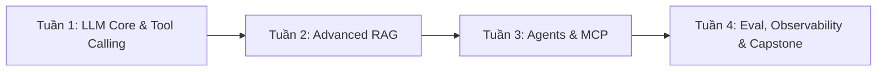

# LỘ TRÌNH 30 NGÀY: FRONTEND DEVELOPER ➔ APPLIED AI ENGINEER (2026)

> **Cơ sở thiết kế**: Tối ưu hóa từ lộ trình 6 tháng chuẩn (*Cường Nguyễn — AI Thực Chiến*) thành **Fast-Track 4 tuần** dành riêng cho kỹ sư Frontend (FE).
> **Định vị cốt lõi**: Khai thác tối đa "Superpower" của Frontend (Streaming, Generative UI, Human-in-the-loop, Event-driven) kết hợp làm chủ 4 bài toán nền tảng của Applied AI: **Structured Output**, **RAG Pipeline**, **AI Agents / MCP**, và **Evaluation / LLMOps**.

---

## MỤC LỤC
1. [Tư Duy Chuyển Đổi (The Paradigm Shift)](#1-tư-duy-chuyển-đổi-the-paradigm-shift)
2. [Tech Stack Tối Ưu Cho Frontend](#2-tech-stack-tối-ưu-cho-frontend)
3. [Chi Tiết Lộ Trình 4 Tuần (30 Ngày)](#3-chi-tiết-lộ-trình-4-tuần-30-ngày)
   - [Tuần 1: LLM Mechanics, Structured Outputs & Tool Calling](#tuần-1-llm-mechanics-structured-outputs--tool-calling)
   - [Tuần 2: Deep-dive RAG Pipeline & Vector Search](#tuần-2-deep-dive-rag-pipeline--vector-search)
   - [Tuần 3: AI Agents, Workflows & Model Context Protocol (MCP)](#tuần-3-ai-agents-workflows--model-context-protocol-mcp)
   - [Tuần 4: Evaluation, Tracing (LLMOps) & Đóng Gói Capstone](#tuần-4-evaluation-tracing-llmops--đóng-gói-capstone)
4. [Thiết Kế Dự Án Capstone Portfolio](#4-thiết-kế-dự-án-capstone-portfolio)
5. [3 Cạm Bẫy Tuyệt Đối Tránh](#5-3-cạm-bẫy-tuyệt-đối-tránh)
6. [Kho Tài Nguyên Tham Khảo](#6-kho-tài-nguyên-tham-khảo)

---

## 1. TƯ DUY CHUYỂN ĐỔI (THE PARADIGM SHIFT)

| Tiêu chí | Web / Frontend Engineer | Applied AI Engineer |
| :--- | :--- | :--- |
| **Bản chất hệ thống** | Tính tiền định (*Deterministic*): Cùng Input $X$ luôn ra Output $Y$. | Tính xác suất (*Probabilistic*): Cùng Prompt có thể ra câu trả lời khác nhau. |
| **Xử lý lỗi** | Catch exception, validate type (TypeScript/Zod). | Retry with schema feedback, fallback models, guardrails. |
| **Đo lường chất lượng** | Unit test, E2E test, Lighthouse score. | Benchmark dataset, Faithfulness, Context Relevance, Cost & Latency. |
| **Superpower của bạn** | Streaming UX, Reactive State, Component-driven design, DOM event. | **Generative UI**, **Human-in-the-loop (HITL) interfaces**, Agent Control Dashboards. |

> [!IMPORTANT]
> **Nguyên tắc số 1**: Không lãng phí thời gian học lại biến số, vòng lặp hay toán cao cấp (đại số tuyến tính, giải tích vi phân). Nhiệm vụ của bạn là **Software Engineering xoay quanh probabilistic models**.

---

## 2. TECH STACK TỐI ƯU CHO FRONTEND

Không cần phải bắt đầu lại từ số 0 với thuần Python. Hệ sinh thái AI bằng TypeScript hiện nay đã đạt cấp độ Production:

* **Ngôn ngữ chủ lực**: **TypeScript** (App, UI, Tool calling, MCP) + **Python** (Cần đọc hiểu và viết script cho Evaluation / Data Processing).
* **AI Application Framework**: **Vercel AI SDK** (`ai`) — Công cụ số 1 thế giới hiện nay cho việc stream token, stream UI, và handle tool call trên React/Next.js.
* **Vector Database**: **Qdrant** (chạy Docker local hoặc Qdrant Cloud) hoặc **Supabase Vector** (`pgvector`).
* **LLM APIs**: OpenAI (`gpt-4o-mini`, `gpt-4o`), Google Gemini (`gemini-2.0-flash` / `gemini-1.5-pro`), Anthropic (`claude-3-5-sonnet`).
* **Observability & Tracing**: **Langfuse** (Tự host hoặc dùng Cloud, hỗ trợ native cả JS/TS lẫn Python SDK).
* **Protocol**: **Model Context Protocol (MCP)** SDK (`@modelcontextprotocol/sdk`).

---

## 3. CHI TIẾT LỘ TRÌNH 4 TUẦN (30 NGÀY)

---

### TUẦN 1: LLM MECHANICS, STRUCTURED OUTPUTS & TOOL CALLING
> **Mục tiêu**: Hiểu bản chất token, context window, latency và cách ép LLM trả về dữ liệu chuẩn để code xử lý an toàn.

#### Phân bổ công việc:
* **Ngày 1 - 2: Khám phá LLM Mechanics & Tokenomics**
  * Hiểu cách Tokenizer hoạt động (BPE - Byte Pair Encoding). Tại sao tiếng Việt tốn nhiều token hơn tiếng Anh?
  * Phân biệt: Context Window, TTFT (Time to First Token), TPS (Tokens Per Second).
  * Công thức tính chi phí: $\text{Cost} = (\text{Prompt Tokens} \times \text{Price}_{\text{in}}) + (\text{Completion Tokens} \times \text{Price}_{\text{out}})$.
  * Thực hành: Viết script TypeScript/Node.js gọi trực tiếp REST API của OpenAI/Gemini (dùng `fetch`, không dùng thư viện bọc) để xem raw headers và usage metadata.
* **Ngày 3: Prompt Engineering & System Prompt Architecture**
  * Cấu trúc một System Prompt chuẩn doanh nghiệp: Role, Objective, Context, Constraints, Fallback behavior.
  * Phân biệt Zero-shot, Few-shot prompting và Chain-of-Thought (CoT).
  * Guardrails cơ bản: Kỹ thuật chống prompt injection (delimiters, XML tags `<context>...</context>`).
* **Ngày 4 - 5: Structured Outputs (Ép kiểu tuyệt đối)**
  * Tại sao regex hoặc prompt "hãy trả về JSON" luôn thất bại ở production?
  * Sử dụng tính năng native `response_format: { type: "json_schema" }`.
  * Tích hợp với thư viện **Zod** trong TypeScript để parse và type-safe toàn bộ output từ LLM.
* **Ngày 6 - 7: Function Calling & Tool Calling**
  * Cách LLM nhận danh sách tools và tự quyết định khi nào cần gọi tool.
  * Flow chuẩn:
    1. User gửi query $\to$ 2. LLM trả về `tool_calls` (name + arguments) $\to$ 3. Backend thực thi code thật $\to$ 4. Gửi kết quả `tool_result` lại cho LLM $\to$ 5. LLM sinh câu trả lời tự nhiên.
  * **Bài tập Tuần 1**: Xây dựng một CLI hoặc Next.js API Route nhận yêu cầu của người dùng, tự động phân tích và kích hoạt 2 công cụ:
    - Tool A: Tra cứu số dư tài khoản từ Database/Mock.
    - Tool B: Quy đổi ngoại tệ theo tỷ giá thời gian thực.
    - Trả về kết quả hoàn chỉnh dưới dạng JSON Schema chuẩn xác.

---

### TUẦN 2: DEEP-DIVE RAG PIPELINE & VECTOR SEARCH
> **Mục tiêu**: Giải quyết bài toán lớn nhất của doanh nghiệp — truy xuất dữ liệu nội bộ chính xác mà không bịa đặt (hallucination).

#### Phân bổ công việc:
* **Ngày 8 - 9: Data Ingestion & Chunking Strategies**
  * Tại sao không được nhét cả tài liệu 50 trang vào context window (chi phí, độ trễ, hiện tượng "Lost in the Middle")?
  * Các chiến lược Chunking: Fixed-size chunking, Paragraph chunking, Markdown Header chunking.
  * Kỹ thuật Chunk Overlap: Giữ ngữ cảnh liền mạch giữa các lát cắt văn bản.
  * Thiết kế Metadata cho Chunk: `document_id`, `page_number`, `created_at`, `section_title`.
* **Ngày 10: Embedding & Vector Database**
  * Bản chất của Embedding: Biến văn bản thành vector $N$-chiều (semantic representation).
  * Độ đo tương đồng: Cosine Similarity, Dot Product, Euclidean Distance.
  * Cài đặt và sử dụng **Qdrant** (hoặc Supabase pgvector): Tạo collection, insert points, query similarity search với metadata filtering.
* **Ngày 11 - 12: Advanced Retrieval & Reranking**
  * Giới hạn của Vector Search thuần túy (dễ trượt khi tìm keyword chính xác như mã SKU, tên riêng).
  * Giải pháp: **Hybrid Search** (kết hợp Dense Semantic Vector + Sparse BM25 Keyword Search).
  * **Reranking**: Dùng Cohere Rerank API để sắp xếp lại top 10 documents tìm được, chỉ lấy ra top 3 chunks chất lượng nhất đưa vào prompt.
* **Ngày 13 - 14: Synthesis, Citations & Mini Project RAG**
  * Kỹ thuật trích dẫn nguồn (*Strict Citation*): Yêu cầu LLM chỉ trả lời dựa trên context được cung cấp, nếu không có phải từ chối rõ ràng; mỗi luận điểm phải gắn kèm `[Doc-ID: Page]`.
  * **Bài tập Tuần 2**: Xây dựng ứng dụng **Document Q&A Portal**:
    - Input: Cho phép upload file PDF/Markdown quy định hoặc tài liệu công ty.
    - Backend: Tự động chunking, sinh embedding, lưu vào Qdrant.
    - Chat Interface: Trả lời câu hỏi kèm danh sách nguồn trích dẫn có thể click xem lại đoạn văn bản gốc.

---

### TUẦN 3: AI AGENTS, WORKFLOWS & MODEL CONTEXT PROTOCOL (MCP)
> **Mục tiêu**: Chuyển từ hệ thống "chỉ hỏi - đáp" sang hệ thống "biết suy luận, lên kế hoạch và thực thi công việc".

#### Phân bổ công việc:
* **Ngày 15 - 16: Deterministic Workflow vs Autonomous Agent**
  * Phân biệt rõ: Khi nào dùng Router/Chain cố định và khi nào trao quyền tự trị cho Agent loop?
  * Mẫu hình **ReAct (Reasoning + Acting)**:
    - Thought $\to$ Action $\to$ Observation $\to$ Decision to stop or continue.
  * Quản trị rủi ro vòng lặp: Cài đặt `max_iterations`, `timeout`, token budget per task.
* **Ngày 17 - 18: Làm chủ Model Context Protocol (MCP)**
  * Hiểu kiến trúc MCP: Client (Host như Claude Desktop, App của bạn) $\longleftrightarrow$ Server (cung cấp Tools, Resources, Prompts).
  * Giao thức: JSON-RPC 2.0 qua Standard I/O (stdio) hoặc Server-Sent Events (SSE).
  * Sử dụng `@modelcontextprotocol/sdk` để viết một MCP Server bằng TypeScript.
* **Ngày 19 - 20: Human-in-the-Loop (HITL) & Agent Control UI**
  * Tận dụng tối đa kỹ năng Frontend: Thiết kế giao diện cho phép con người kiểm soát Agent.
  * Cơ chế phê duyệt hành động nhạy cảm (*Action Approval Pattern*): Khi Agent muốn thực hiện tool nguy hiểm (ví dụ: `send_email`, `delete_record`, `transfer_money`), hệ thống dừng lại, render modal xác nhận trên UI và đợi user click Approve/Reject trước khi tiếp tục.
* **Ngày 21: Mini Project Agent**
  * **Bài tập Tuần 3**: Xây dựng **Automated Research & Report Agent**:
    - Tự viết một MCP Server cung cấp 2 tool: (1) `fetch_web_article(url)` và (2) `save_markdown_report(filename, content)`.
    - Cho Agent tự động phân tích yêu cầu nghiên cứu, tìm đọc tài liệu, tổng hợp dàn ý, yêu cầu người dùng xác nhận trên UI, sau đó lưu file báo cáo hoàn chỉnh.

---

### TUẦN 4: EVALUATION, TRACING (LLMOPS) & ĐÓNG GÓI CAPSTONE
> **Mục tiêu**: Đưa ứng dụng đạt chuẩn Production, đo lường độ tin cậy bằng số liệu thay vì "cảm giác".

#### Phân bổ công việc:
* **Ngày 22 - 23: Evaluation (Đánh giá định lượng)**
  * Tại sao không bao giờ được kiểm thử bằng 3 câu hỏi tùy hứng?
  * Xây dựng bộ **Evaluation Dataset** (20 - 30 test cases: Input, Ground Truth, Expected Context).
  * Các metric RAG cốt lõi:
    - *Context Relevance*: Chunks tìm được có thực sự liên quan câu hỏi không?
    - *Faithfulness (Groundedness)*: Câu trả lời có hoàn toàn dựa trên context hay bịa đặt?
    - *Answer Correctness*: Câu trả lời có đúng với ground truth không?
  * Kỹ thuật **LLM-as-a-judge**: Viết prompt chuẩn hóa (Rubric) cho model mạnh hơn (GPT-4o) chấm điểm câu trả lời của model chạy thực tế theo thang điểm từ 1 đến 5.
* **Ngày 24 - 25: Observability & Tracing với Langfuse**
  * Cài đặt Langfuse vào Next.js API / Backend.
  * Ghi lại toàn bộ cây thực thi (Trace & Spans): Mỗi request đi qua những bước nào, tốn bao nhiêu ms, tốn bao nhiêu token, tốn bao nhiêu USD.
  * Thiết lập Alert khi chi phí token vượt ngưỡng hoặc latency quá cao.
* **Ngày 26 - 27: Streaming UX & Generative UI (Vercel AI SDK)**
  * Ứng dụng thế mạnh Frontend:
    - Stream token mượt mà không bị giật layout (auto-scroll, markdown parsing incremental).
    - **Generative UI**: Khi model gọi tool tra cứu vé máy bay hoặc thời tiết, không render text thô mà stream trực tiếp React Component tương ứng (`<FlightCard />`, `<WeatherWidget />`).
* **Ngày 28 - 30: Hoàn thiện Capstone Project & Portfolio Artifact**
  * Đóng gói code sạch sẽ, tuân thủ strict typing.
  * Viết tài liệu kiến trúc (Architecture Diagram, Sequence Diagram).
  * Public repo lên GitHub kèm README chi tiết (giải thích Chunking, Retrieval metrics, Latency/Cost trade-offs).

---

## 4. THIẾT KẾ DỰ ÁN CAPSTONE PORTFOLIO

Để CV của bạn nổi bật hoàn toàn so với những người chỉ làm chatbot gọi API cơ bản, hãy xây dựng dự án sau:

### Tên dự án: Enterprise Knowledge Copilot & Action Agent
* **Giao diện (Frontend)**: Next.js 15/16 App Router, Tailwind CSS, Vercel AI SDK (Streaming markdown + Generative UI components).
* **Kiến trúc dữ liệu (RAG)**:
  * Ingestion: Upload tài liệu (PDF, Docs).
  * Chunking: Semantic Chunking có metadata.
  * Storage: Qdrant Vector Database.
  * Retrieval: Hybrid Search (BM25 + Dense) kết hợp Cohere Rerank.
* **Cơ chế Agent & Tooling**:
  * Tích hợp MCP Server để thực hiện truy vấn nội bộ.
  * Human-in-the-loop: Bảng điều khiển duyệt lệnh trước khi Agent thực thi thao tác ghi.
* **Production & Observability**:
  * Toàn bộ pipeline được trace chi tiết bằng Langfuse (Latency, Input/Output Token, Cost).
  * File test suite chạy tự động LLM-as-a-judge cho 30 câu hỏi benchmark, in ra bảng điểm Faithfulness và Context Recall.

---

## 5. 3 CẠM BẪY TUYỆT ĐỐI TRÁNH

> [!CAUTION]
> 1. **Bẫy học toán & Machine Learning hàn lâm**:
>    Applied AI Engineer tập trung vào việc **tích hợp, kiểm soát và tối ưu hệ thống dùng mô hình có sẵn**. Dành 1 tháng để học đạo hàm, tích phân hay viết mạng nơ-ron từ đầu sẽ khiến bạn không hoàn thành được bất kỳ sản phẩm thực tế nào.
>
> 2. **Bẫy "Framework Dependency" (Phụ thuộc mù quáng vào LangChain)**:
>    LangChain có quá nhiều tầng abstraction làm che giấu bản chất API call. Hãy bắt đầu bằng Vercel AI SDK hoặc gọi trực tiếp API provider. Bạn cần biết rõ payload JSON gửi đi và nhận về trông như thế nào.
>
> 3. **Bẫy "Demo Syndrome" (Thiếu Evaluation)**:
>    Sự kết hợp giữa một lập trình viên tay ngang và một Applied AI Engineer chuyên nghiệp là **khả năng chứng minh hệ thống hoạt động tốt bằng số liệu**. Đừng bao giờ phỏng vấn với câu: *"Em thấy nó trả lời ổn"*. Hãy nói: *"Hệ thống đạt 91% Faithfulness trên tập 40 test cases với chi phí trung bình $0.0025 mỗi phiên"*.

---

## 6. KHO TÀI NGUYÊN THAM KHẢO CHẤT LƯỢNG CAO

* **Tài liệu chính thức**:
  * [OpenAI Structured Outputs Guide](https://platform.openai.com/docs/guides/structured-outputs)
  * [Vercel AI SDK Core Documentation](https://sdk.vercel.ai/docs/introduction)
  * [Model Context Protocol Specification (modelcontextprotocol.io)](https://modelcontextprotocol.io)
  * [Qdrant Documentation & Vector Search Basics](https://qdrant.tech/documentation/)
  * [Langfuse LLM Observability Guide](https://langfuse.com/docs)
* **Bài viết & Khóa học thực chiến**:
  * Bài viết gốc: [Roadmap Trở Thành AI Engineer 2026: Từ Zero đến Hero — Cường Nguyễn](https://cuongnguyen.ai.vn/blog/roadmap-ai-engineer-2026-zero-hero)
  * DeepLearning.AI: *Building Systems with the ChatGPT API*, *Advanced Retrieval for AI with Chroma*, *AI Agents in Practice*.
