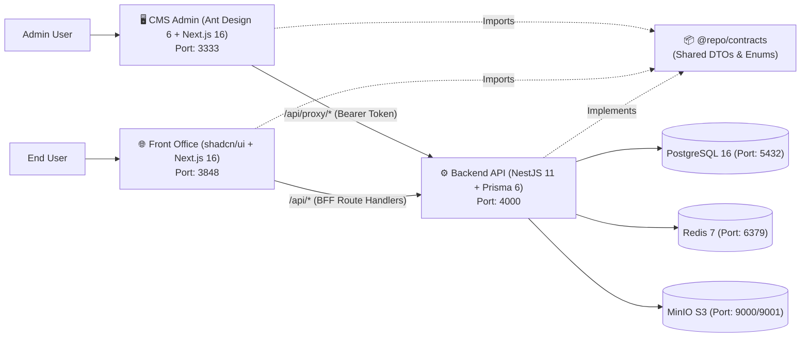

# Enterprise Starter Templates (Fullstack Monorepo / Multi-Package)

Bộ khung chuẩn mực (Starter Boilerplate) đa tầng cho hệ thống Web Enterprise, tách biệt hoàn toàn giữa Core Engine và Business Logic, tối ưu hóa cho lập trình viên và 11 Agent Pods của `agentC-kit`.

---

## 🗺️ 1. Bản Đồ Tổng Quan (Architecture Map)



---

## 📦 2. Danh Mục Template & Packages

| Thư mục | Tech Stack | Mục đích | Tài liệu cho AI Agent |
|---|---|---|---|
| [`packages/contracts/`](./packages/contracts/) | TypeScript 5, class-validator, class-transformer | Gói DTOs, Enums và Response Envelopes dùng chung giữa BE & FE | [Contracts README](./packages/contracts/) |
| [`be/`](./be/README.md) | NestJS 11, Prisma 6, Redis, JWT, Swagger | Core API, Clean Architecture 4 tầng | [BE Agent Rules](./be/README.md) |
| [`cms/`](./cms/README.md) | Next.js 16, Ant Design 6, TanStack Query v5, CASL | Admin Portal, quản lý dữ liệu, phân quyền | [CMS Agent Rules](./cms/README.md) |
| [`fo/`](./fo/README.md) | Next.js 16, Tailwind 4, Radix/shadcn, Zod | Trang đích, portal người dùng, BFF pattern | [FO Agent Rules](./fo/README.md) |

---

## 🚀 3. Hướng Dẫn Khởi Động Nhanh (Quick Start)

### Bước 1: Khởi động cơ sở dữ liệu & hạ tầng (Docker Compose)
```bash
cd templates
yarn docker:up
```
Lệnh trên sẽ khởi chạy với healthcheck tự động:
- **PostgreSQL 16** tại cổng `5432` (`postgres:postgres_secure_pass@localhost:5432/starter_template_db`)
- **Redis 7** tại cổng `6379`
- **MinIO S3** tại cổng `9000` (API) & `9001` (Console) (user/pass: `minioadmin` / `minioadmin_secret`)
- Tự động tạo sẵn bucket `media-store` với quyền private access.

### Bước 2: Khởi tạo cơ sở dữ liệu & Dữ liệu mẫu tất định (Seed Data)
```bash
# Cấu hình môi trường Backend
cd be
cp .env.example .env

# Chạy Migration hoặc Push Schema
yarn db:push
# Hoặc chuẩn hóa Enterprise: yarn db:migrate

# Nạp dữ liệu mẫu tất định (Deterministic Seed)
yarn db:seed
```

#### 🔑 Tài khoản mặc định sau khi seed:
| Vai trò | Email | Mật khẩu mặc định | Quyền hạn |
|---|---|---|---|
| **Super Admin** | `admin@example.com` | `Admin@123456` | Toàn quyền quản trị hệ thống (`SUPER_ADMIN`) |
| **Standard User** | `user@example.com` | `User@123456` | Người dùng tiêu chuẩn (`USER`) |

### Bước 3: Khởi động các ứng dụng

#### Lựa chọn A: Khởi động độc lập từng dịch vụ
```bash
# 1. Backend API (Port 4000)
cd be && yarn dev

# 2. CMS Admin (Port 3333)
cd ../cms && cp .env.example .env.local && yarn dev

# 3. Front Office (Port 3848)
cd ../fo && cp .env.example .env.local && yarn dev
```

#### Lựa chọn B: Điều phối từ thư mục gốc Monorepo
```bash
cd templates
yarn dev:be   # Chạy Backend (Port 4000)
yarn dev:cms  # Chạy CMS Admin (Port 3333)
yarn dev:fo   # Chạy Front Office (Port 3848)
```

---

## 🧪 4. Kiểm Thử Tự Động Hóa (Testing & Quality Gates)

```bash
# Chạy toàn bộ test suite trên cả 3 tầng (356 tests pass)
yarn test

# Chạy Unit & Integration Tests theo từng workspace
yarn test:be        # Backend Jest suite (148 tests)
yarn test:cms       # CMS Vitest suite (158 tests)
yarn test:fo        # Front Office Vitest suite (50 tests)

# Typecheck & Lint toàn bộ workspace
yarn typecheck
yarn lint

# Build production bundle toàn bộ workspace
yarn build
```

---

## 🤖 5. Nguyên Tắc Cho AI Agent Khi Làm Việc Trong Templates

1. **Tuân thủ đúng ranh giới trách nhiệm (Ownership)**:
   - Backend sở hữu toàn bộ logic nghiệp vụ, xác thực, phân quyền và database access.
   - Frontend không truy cập database trực tiếp và không tự định đoạt authorization logic.
2. **Kế thừa Hợp đồng từ `@repo/contracts`**:
   - Sử dụng chung các DTOs, Enums (`UserRole`, `EntityStatus`) và Response Envelope (`ApiSuccessResponse`, `ApiErrorResponse`).
   - Cấm tự chế type riêng biệt gây ra hiện tượng Type Drift.
3. **Quy chuẩn Response Envelope thống nhất**:
   - Thành công: `{ data: T }` hoặc `{ data: T[], meta: { pagination: { ... } } }`.
   - Lỗi: `{ error: { status, message, details?: ... } }`.
4. **No Any & Strict Typing**:
   - 100% code TypeScript có type rõ ràng. Hạn chế tối đa dùng `any`.
5. **Không duplicate code**:
   - Mọi feature mới phải bám sát Reference Sample Module có sẵn trong từng thư mục template.

---

## ⚡ 6. Tra Cứu Tài Liệu JIT Với Context7 MCP & Quy Chuẩn Giao Diện

### Context7 MCP Server
Template được cấu hình sẵn sàng tương thích với server `context7` trong `.mcp.json` (`resolve-library-id` & `query-docs`). Agent khi cần tra cứu các API mới nhất của:
- **Next.js 16.1 App Router**: `resolve-library-id(libraryName="nextjs")` $\rightarrow$ `query-docs(libraryId="...", query="...")`
- **Ant Design 6**: `resolve-library-id(libraryName="antd")` $\rightarrow$ `query-docs(libraryId="...", query="...")`
- **Tailwind CSS 4**: `resolve-library-id(libraryName="tailwindcss")` $\rightarrow$ `query-docs(libraryId="...", query="...")`
- **NestJS 11**: `resolve-library-id(libraryName="nestjs")` $\rightarrow$ `query-docs(libraryId="...", query="...")`

### Chuẩn Mực Giao Diện & Clean Code (Skills: `web-design-guidelines` & `clean-code`)
1. **Focus & Keyboard Navigation**: Mọi tương tác (Button, Input, Action items) phải có `focus-visible:ring-2 focus-visible:ring-primary` rõ ràng.
2. **Khả năng tiếp cận (Accessibility / a11y)**:
   - Các icon-only button (như `CopyButton`, `AppScrollToTop`) bắt buộc có `aria-label`.
   - Các trường tìm kiếm sử dụng ký tự ellipsis chuẩn `…` thay vì ba dấu chấm `...`.
3. **Hiển thị số liệu trong Bảng biểu**:
   - Mọi bảng dữ liệu (`AppTable`) áp dụng `tabular-nums` để canh thẳng hàng chữ số thập phân và các cột tiền tệ / ngày giờ.
4. **Clean Code & Zero Dead Comments**:
   - Giữ mã nguồn tự giải thích (self-documenting), không lưu trữ mã chú thích rác hay comment dư thừa trong source code.
