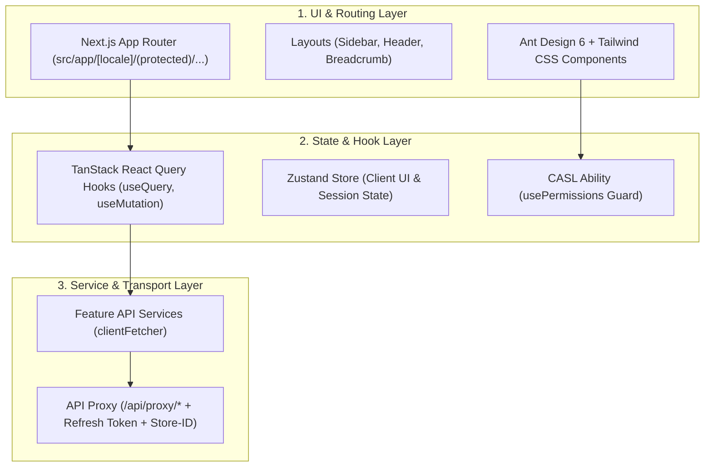

# CMS Admin — Next.js 16 & Ant Design 6 Starter Template

Starter Template chuẩn Doanh nghiệp cho Cổng quản trị Admin xây dựng trên **Next.js 16 (App Router + Turbopack)**, **React 19**, **Ant Design 6**, **TanStack Query v5**, **CASL (RBAC)**, và **Tailwind CSS 4**.

> **Dành cho AI Agents (Cursor, Claude, Antigravity):** Hãy đọc kỹ toàn bộ tài liệu này trước khi tạo hoặc chỉnh sửa bất kỳ màn hình/tính năng nào trong template.

---

## 🏛️ 1. Nguyên Tắc Thiết Kế (Design Principles)



### Ranh giới kiến trúc:
1. **Tách biệt Logic và UI**:
   - UI Component chỉ đảm nhận việc render và nhận tương tác từ người dùng.
   - Tuyệt đối **không gọi trực tiếp fetch/axios trong UI Component**. Mọi lệnh gọi API phải đi qua `services/` và được bọc bởi hook React Query trong `hooks/`.
2. **Chiến lược Styling (Tailwind + Ant Design)**:
   - Dùng **Ant Design 6** cho các components có logic phức tạp: Table, Form, DatePicker, Select, Modal, Drawer.
   - Dùng **Tailwind CSS 4** cho cấu trúc layout, khoảng cách (margin/padding), căn lề (flex/grid), màu sắc và typography. Hạn chế tối đa việc tạo file `.css`/`.scss` rời.

---

## 🚫 2. Quy Tắc Bất Biến Cho AI Agent (Zero-Tolerance Rules)

1. **CẤM dùng `any`**: Sử dụng interface/type rõ ràng cho Props, State, và API Data.
2. **Data Fetching qua React Query**:
   - Tất cả request lấy dữ liệu (GET) phải dùng `useQuery`.
   - Tất cả thao tác thay đổi dữ liệu (POST, PUT, DELETE) phải dùng `useMutation`.
   - Query Keys phải được định nghĩa tập trung (ví dụ `FEATURE_QUERY_KEYS`).
3. **Quản lý trạng thái URL (`nuqs`)**:
   - Phân trang (page, pageSize), tìm kiếm (search), và bộ lọc (filter) trên bảng phải đồng bộ lên URL Search Params.
4. **Phân quyền (RBAC)**:
   - Kiểm tra quyền bằng hook `usePermissions()` hoặc component `<Can I="..." a="...">` từ `@/shared/rbac`.
   - Frontend chỉ ẩn/hiện UI; không coi frontend là chốt chặn bảo mật duy nhất (Backend sẽ chặn thật).
5. **Xử lý thời gian**: 100% sử dụng `dayjs` và format theo chuẩn UTC.

---

## 📁 3. Cấu Trúc Thư Mục (Directory Anatomy)

```text
src/
├── app/
│   └── [locale]/
│       ├── (auth)/             # Route công khai: /signin, /forgot-password
│       └── (protected)/        # Route yêu cầu đăng nhập (Admin Shell)
│           ├── dashboard/      # Trang tổng quan
│           ├── sample/         # ⭐️ REFERENCE CRUD PAGE (Mẫu Antd Table + Form Drawer)
│           ├── users/          # Quản lý tài khoản
│           ├── roles/          # Quản lý vai trò
│           └── permissions/    # Quản lý quyền
├── configs/                    # Cấu hình app, navigation, menu, theme Antd
├── features/
│   ├── sample/                 # ⭐️ REFERENCE FEATURE (Mẫu cấu trúc chuẩn)
│   │   ├── models/             # Interface DTOs (Request / Response)
│   │   ├── services/           # Định nghĩa endpoint & clientFetcher
│   │   ├── hooks/              # useQuery, useMutation với TanStack Query
│   │   └── index.ts            # Public export của feature
│   ├── auth/                   # Xử lý đăng nhập, phiên làm việc
│   └── user-management/        # Nghiệp vụ tài khoản
├── layouts/                    # MainLayout (Sidebar responsive, Header, User Menu)
└── shared/                     # UI components, lib/http, rbac, stores, i18n
```

---

## 🛠️ 4. Quy Trình Cho AI Agent Khi Tạo Màn Hình Mới

### Cách 1: Sử dụng Scaffolding Script tự động
```bash
# Tự động tạo thư mục feature với models, service, hooks:
npm run gen:crud <feature-name>
```

### Cách 2: Tạo thủ công chuẩn theo Reference `sample`
1. **Tạo Model** (`src/features/<name>/models/<name>.model.ts`): Khai báo interface dữ liệu.
2. **Tạo Service** (`src/features/<name>/services/<name>.service.ts`): Khai báo API endpoints dùng `clientFetcher`.
3. **Tạo React Query Hooks** (`src/features/<name>/hooks/use<Name>Query.ts`): Viết `useQuery` và các `useMutation` có thông báo `message.success` và invalidate queries.
4. **Export tại Index** (`src/features/<name>/index.ts`).
5. **Tạo Giao diện Trang** (`src/app/[locale]/(protected)/<name>/page.tsx`): Sử dụng `Table`, `Card`, `Button`, `Modal`/`Drawer` của Antd.
6. **Đăng ký Menu**:
   - Thêm đường dẫn vào `src/configs/app/features/navigation.config.tsx`.
   - Thêm mục hiển thị trên Sidebar tại `src/configs/app/features/shell-navigation.config.tsx`.

---

## ⌨️ 5. Cheat Sheet Lệnh Thực Thi

```bash
# Cài đặt thư viện
npm install

# Khởi chạy dev server (cổng 3333, Turbopack)
npm run dev

# Kiểm tra TypeScript typecheck
npm run typecheck

# Kiểm tra Linter
npm run lint

# Chạy kiểm thử tự động (Vitest)
npm run test

# Build production
npm run build
```
